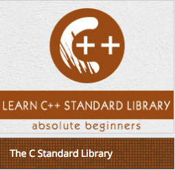

```
Roberto Nogueira  
BSd EE, MSd CE
Solution Integrator Experienced - Certified by Ericsson
```
# Tutorialspoint C++ STL



**About This Tutorial**

This is to grasp rapidly the language and its concepts.

[C++ Tutorial](https://www.tutorialspoint.com/cpp_standard_library/index.htm)

#### Topics
```
The C++ Standard Library
[ ] C++ Library - Home
[ ] C++ Library - <fstream>
[ ] C++ Library - <iomanip>
[ ] C++ Library - <ios>
[ ] C++ Library - <iosfwd>
[ ] C++ Library - <iostream>
[ ] C++ Library - <istream>
[ ] C++ Library - <ostream>
[ ] C++ Library - <sstream>
[ ] C++ Library - <streambuf>
[ ] C++ Library - <atomic>
[ ] C++ Library - <complex>
[ ] C++ Library - <exception>
[ ] C++ Library - <functional>
[ ] C++ Library - <limits>
[ ] C++ Library - <locale>
[ ] C++ Library - <memory>
[ ] C++ Library - <new>
[ ] C++ Library - <numeric>
[ ] C++ Library - <regex>
[ ] C++ Library - <stdexcept>
[ ] C++ Library - <string>
[ ] C++ Library - <thread>
[ ] C++ Library - <tuple>
[ ] C++ Library - <typeinfo>
[ ] C++ Library - <utility>
[ ] C++ Library - <valarray>

The C++ STL Library
[ ] C++ Library - <array>
[ ] C++ Library - <bitset>
[ ] C++ Library - <deque>
[ ] C++ Library - <forward_list>
[ ] C++ Library - <list>
[ ] C++ Library - <map>
[ ] C++ Library - <queue>
[ ] C++ Library - <set>
[ ] C++ Library - <stack>
[ ] C++ Library - <unordered_map>
[ ] C++ Library - <unordered_set>
[ ] C++ Library - <vector>
[ ] C++ Library - <algorithm>
[ ] C++ Library - <iterator>

C++ Programming Resources
[ ] C++ Programming Tutorial
[ ] C++ Useful Resources
[ ] C++ Discussion
[ ] Selected Reading
[ ] Developer's Best Practices
[ ] Questions and Answers
[ ] Effective Resume Writing
[ ] HR Interview Questions
[ ] Computer Glossary
[ ] Who is Who
```

